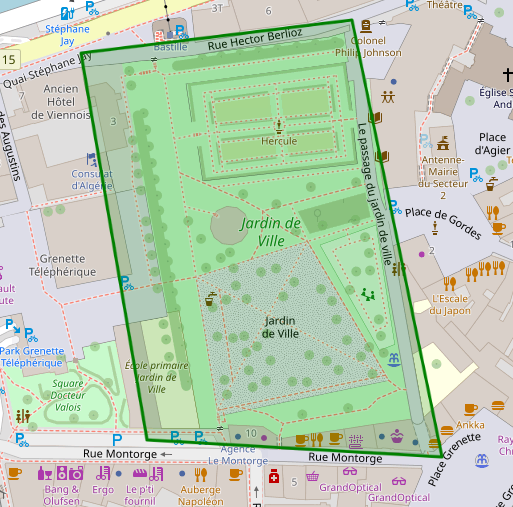

# Creating Interactive Maps with Leaflet: Alice's Guide to Grenoble

Welcome! In this tutorial, you’ll learn how to create interactive maps using **Leaflet.js**. <br> Alice, a Grenoble resident, wants to showcase her city’s landmarks on a map. Let’s join her on this journey and build a map together!

## Prerequisites

Before we start, make sure you have:

- **Basic knowledge** of `HTML`, `CSS`, and `JavaScript`.  
  *(Even if you’re new, don’t worry—our detailed comments will guide you through!)*  
- A **text editor**, such as `Visual Studio Code` or `Notepad++`.  
- A **modern web browser** with Internet access.

# Step-by-Step Plan (23 steps)

Here’s the roadmap for building Alice’s Grenoble map:

## Creating Base Files (4 Steps)
1. Create the `script.js` File.
2. Create the `index.html` File.
3. Link the `script.js` File to the `index.html` File
4. Import the Leaflet library into the `index.html` File.

## Map Setup and Configuration (2 Steps)
5. Center the map on Grenoble.
6. Enable users to toggle between two tile layers.

## Adding Map Features (4 Steps)
7. Place a marker at La Bastille.
8. Customize the marker icon with a castle image.
9. Add an informational popup to the marker.
10. Zoom in on La Bastille when its marker is clicked.

## Adding Geometric Shapes and Lines (5 Steps)
11. Draw a circle to outline Jardin de Ville.
12. Replace the circle with a precise polygon for better accuracy.
13. Add a red line simulating the cable car route between La Bastille and Jardin de Ville.
14. Display the distance of the cable car route as a tooltip.
15. Make the tooltip visible only at a certain zoom level.

## Importing External Data (6 Steps)
16.  Visit the SMMAG website for relevant Grenoble datasets.
17.  Retrieve the dataset for Grenoble’s cycling routes.
18.  Import and overlay the cycling routes on the map.
19.  Discover leaflet plugins.
20.  Add a geocoder for searching locations on the map.
21.  Enable the geocoder in JavaScript.

## Additional Features (2 Steps)
22. Add a scale bar for distance reference.
23. Include a legend to differentiate between cycling routes and the cable car.

___ 
<br>

# Creating Base Files (4 steps)

## Step 1: Create the `script.js` File
Alice starts her project by creating the `script.js` file. This file will house all the JavaScript code for her map. She knows there’s no need to write anything in it just yet because the JavaScript file needs to be linked to an HTML file to be effective.

## Step 2: Create the `index.html` File
Next, Alice creates the `index.html` file, which will act as the foundation for displaying her map. She begins by writing the basic structure of the HTML file:

```html
<!doctype html>
<html lang="en">
<head>
    <meta charset="UTF-8">
    <meta name="viewport"
          content="width=device-width, user-scalable=no, initial-scale=1.0, maximum-scale=1.0, minimum-scale=1.0">
    <meta http-equiv="X-UA-Compatible" content="ie=edge">
    <title>Leaflet Tutorial</title>
</head>
<body style="margin: 0">
</body>
</html>
```
💡 Notice the inline CSS in the `<body>` tag. Setting `margin: 0`; ensures the map takes up the full screen without unwanted white space.

## Step 3: Link the `script.js` File to the `index.html` file

Now, Alice links the script.js file at the end of the `<body>` tag:

```html
<body style="margin: 0">
<script src="script.js"></script>
</body>
```

⚠️ **Important!** Always include JavaScript files at the end of the `<body>` tag. Why? Placing them earlier may cause errors if the HTML content hasn’t finished loading.

## Step 4: Import the Leaflet library into the `index.html` file.

In order to use Leaflet.js in her project, Alice needs to import both the CSS and JavaScript files provided by Leaflet. These files are hosted online, so she can link to them directly without needing to download or host them ourselves. These types of files should be placed inside the `<head>` section of the HTML document.

```html
<link rel="stylesheet" href="https://unpkg.com/leaflet/dist/leaflet.css" />
<script src="https://unpkg.com/leaflet/dist/leaflet.js"></script>
```

Once the Leaflet library is included, Alice need to add a `<div>` element in the `<body>` section of her HTML file to serve as the container for the map. This is where the map will be displayed when the page is loaded.
```html
<body>
<div id="map" style="height:100vh;"></div>
</body>
```

⚠️ **Important!** If Alice don't add the `id="map"` to the `<div>` element and set its height, the map will not be displayed. This is because Leaflet needs this specific id to target the correct container for rendering the map, and it requires a specified height to know how much space to occupy. Without these, Leaflet can't properly initialize the map.

Here’s how the index.html file should look now, with the Leaflet CSS and JavaScript files properly imported:
```html
<!doctype html>
<html lang="en">
<head>
    <meta charset="UTF-8">
    <meta name="viewport"
          content="width=device-width, user-scalable=no, initial-scale=1.0, maximum-scale=1.0, minimum-scale=1.0">
    <meta http-equiv="X-UA-Compatible" content="ie=edge">
    <title>Leaflet Tutorial</title>

    <!--  LEAFLET SCRIPT  -->
    <link rel="stylesheet" href="https://unpkg.com/leaflet/dist/leaflet.css" />
    <script src="https://unpkg.com/leaflet/dist/leaflet.js"></script>

</head>
<body style="margin: 0">
<!-- IF YOU DON'T ADD THE ID "MAP" TO THE DIV ELEMENT AND DON'T SPECIFY IT'S HEIGHT, IT WILL NOT BE DISPLAYED -->
<div id="map" style="height:100vh;"></div>
<script src="script.js"></script>
</body>
</html>
```
# Map Setup and Configuration (2 steps) 

Now that the basic setup is complete, Alice moves on to configuring the map in the `script.js` file!

## Step 5: Center the map on Grenoble.

When Alice opens ```index.html``` in her browser, the map currently displays a blank white screen. To fix this, she needs to add a map background (or "tile layer") using **OpenStreetMap**.

Alice begins by defining the URL template for the OpenStreetMap tile layer, which provides the map’s visual background:

```js
// URL for OpenStreetMap
const osm_url = 'https://{s}.tile.openstreetmap.org/{z}/{x}/{y}.png';
```
Next, Alice creates a variable called `streets` to define the map's base layer. She uses Leaflet’s `L.tileLayer` function, which loads the tiles based on the provided URL.

```js
// Definition of the classic map background
const streets = L.tileLayer(osm_url);
```

💡 **Documentation Reference:** For more details about `L.tileLayer`, check out the [Leaflet documentation](https://leafletjs.com/reference.html#tilelayer).

Alice sets up an array with the GPS coordinates of Grenoble to center the map correctly. Grenoble is located at latitude `45.1885` and longitude `5.7245`.
```js
const grenobleGPS = [45.1885, 5.7245]
```

Alice can now use the variables she created to display Grenoble on the map!

She uses Leaflet’s `map` function to initialize the map. By passing the variables she prepared, she specifies the center of the map (Grenoble’s coordinates) and sets the default zoom level to 13.

```js
// Default map initialization
const map = L.map('map', {
    center: grenobleGPS, // Grenoble
    zoom: 13, // Default zoom level
    layers: [streets] // Streets enabled by default
});
```
💡 **Documentation Reference:** For more details about `L.map`, check out the [Leaflet documentation](https://leafletjs.com/reference.html#map).

With this setup, Alice can now see Grenoble displayed beautifully on her map! <br>
Pretty simple, right? 😊 


## Step 6: Enable users to toggle between the two tile layers.

Great progress! But Alice wants users to enjoy Grenoble’s stunning mountains from a satellite view as well. To achieve this, she’ll add the option to switch between a classic map background and a satellite map background.

Alice decides to use **ESRI** for the satellite imagery layer. She follows the same process as she did for the OpenStreetMap tiles:

```js
// URL for Esri Satellite tiles
const esriUrl = 'https://server.arcgisonline.com/ArcGIS/rest/services/World_Imagery/MapServer/tile/{z}/{y}/{x}';

// Define the satellite map background
const satellite = L.tileLayer(esriUrl);
```
To test the satellite view, Alice replaces the streets layer with the satellite layer in the map initialization:

```js
// Default map initialization
const map = L.map('map', {
    center: grenobleGPS, // Grenoble
    zoom: 13, // Default zoom level
    layers: [satellite] // Satellite enabled by default
});
```

Now, when Alice refreshes her browser, the map displays Grenoble with the satellite background 🤩.


Next, Alice gives users the option to toggle between the classic map and satellite map. First, she groups both tile layers and assigns them display names:

```js
// Group the maps and rename them for better display
const baseMaps = {
    "Streets (OSM)": streets,
    "Satellite (Esri)": satellite
};
```

Then, she adds a layer control to the map using Leaflet’s `L.control.layers` function:

```js
// Add layer control to the map
const chooseMaps = L.control.layers(baseMaps).addTo(map);
```
💡 **Documentation Reference:** For more details about `L.control`, check out the [Leaflet documentation](https://leafletjs.com/examples/layers-control/).

Now, Alice notices a small icon in the top-right corner of the map. When she hovers her mouse over it, a dropdown menu appears, allowing her to switch between the Streets (OSM) view and the Satellite (Esri) view with a single click! <br>


# Adding Map Features (4 steps)

Now that our map is displaying correctly, Alice would like to add some interactivity to it.

She has always wondered about the distance covered by the cable car in her hometown!

## Step 7: Place a marker at La Bastille.

Alice decides to start by adding a marker on the map, at the emblematic monument of the city and also the endpoint of the cable car: ***La Bastille***.

To do this, she begins by retrieving the GPS coordinates of the location she's interested in:

```js
const bastilleGPS = [45.198601, 5.724592];
```

Then, she uses Leaflet's `marker` function to display a marker at these coordinates:

```js
// Create a default Bastille marker
const bastille = L.marker(bastilleGPS).addTo(map);
```
💡 **Documentation Reference:** For more details about `L.marker`, check out the [Leaflet documentation](https://leafletjs.com/reference.html#marker).


We now have a blue marker displayed on La Bastille in Grenoble !

But Alice finds it a bit boring. She would prefer a more meaningful icon.

She decides to create a custom icon.

## Step 8: Customize the marker icon with a castle image.

She starts by looking online for the image she wants: a picture of a castle!

Once she finds the right image, she copies its URL and uses it in the following code:

```js
// Create a custom icon for the marker
const castleIcon = L.icon({
    iconUrl: 'https://cdn-icons-png.flaticon.com/512/6161/6161670.png',  // Path to the icon image
    iconSize: [32, 32], // Icon size
    iconAnchor: [16, 32], // Anchor point of the icon (where the icon is attached to the marker)
    popupAnchor: [0, -32] // Anchor point of the popup
});
```
💡 **Documentation Reference:** For more details about `L.icon`, check out the [Leaflet documentation](https://leafletjs.com/reference.html#icon).

Now she needs to modify her `bastille` variable to use a custom icon:

```js
const bastilleMarker = L.marker(bastilleGPS, {icon: castleIcon}).addTo(map);
```

TADAM! Now we have a beautiful castle icon 🏰!


## Step 9: Add an informational popup to the marker.

Alice now wants to add some interactivity to her new marker.

She starts by adding a **popup** that displays the name of the landmark when the user clicks on it:

```js
const bastilleMarker = L.marker(bastilleGPS, {icon: castleIcon}).addTo(map).bindPopup("The Bastille of Grenoble");
```
## Step 10: Zoom in on La Bastille when its marker is clicked.

Then, Alice decides to add functionality to **zoom in** automatically whenever the marker is clicked:

```js
// Every time the user clicks on the Bastille marker, it will zoom on it
bastilleMarker.on('click', function() {
    // Zoom in on the Bastille marker with a zoom level of 16 (adjust as needed)
    map.setView(bastilleGPS, 16); // Latitude, longitude, zoom level
});
```


# Adding Geometric Shapes and Lines (5 steps)

Now that Alice has handled the endpoint of the cable car, ***La Bastille***, she needs to take care of the starting point!

The departure is from the ***Jardin de Ville***, and she thinks it would be nice to outline this iconic park in her city.

## Step 11: Draw a circle to outline Jardin de Ville.

To do this, she decides to use the `circle` function provided by Leaflet.

```js
const jdvGPS = [45.192184, 5.726669]

// Delimit the city garden with a circle, but it's not very precise...
const jdv = L.circle(jdvGPS, {
    color: 'green',
    radius: 100
}).addTo(map);
```

💡 **Documentation Reference:** For more details about `L.circle`, check out the [Leaflet documentation](https://leafletjs.com/reference.html#circle).


## Step 12: Replace the circle with a precise polygon for better accuracy.

This works well, but Alice would like something even more precise... To do this, she will use the `Polygon` function from Leaflet.

Since the shape of Jardin de Ville is roughly rectangular, she will gather the four GPS coordinates of the park’s four corners to outline its perimeter.

```js
// Delimit the perimeter of the city garden
const jdvPerimeter = [
    [45.192890, 5.725622],
    [45.193016, 5.727075],
    [45.191364, 5.727556],
    [45.191428, 5.725975]
];
```
Now she just needs to replace the `Circle` function with the `Polygon` function and add a small popup, just like for ***La Bastille***.

```js
// Delimit the city garden with a polygon drawn from the garden perimeter, much more precise!
const jdv = L.polygon(jdvPerimeter, {color: 'green'}).addTo(map).bindPopup("Jardin de ville");
```

💡 **Documentation Reference:** For more details about `L.polygon`, check out the [Leaflet documentation](https://leafletjs.com/reference.html#polygon).

And there you go, much better, right? 😉



## Step 13: Add a red line simulating the cable car route between La Bastille and Jardin de Ville.

Now that Alice has marked the starting and ending points of the cable car, she just needs to connect them with the path the cable car takes.

After drawing a circle with the `Circle` function, a polygon with the `Polygon` function, \**drum roll* 🥁\*. She will now draw a line using the `Polyline` function!

```js
// GPS coordinates of the cable car
const cableCar = [45.19295, 5.726035]

// Create a line simulating the cable car between the Bastille and the Jardin de Ville
const line = L.polyline([bastilleGPS, cableCar], {
    color: 'red',
    weight: 3,
}).addTo(map);
```
💡 **Documentation Reference:** For more details about `L.polyline`, check out the [Leaflet documentation](https://leafletjs.com/reference.html#polyline).


## Step 14: Display the distance of the cable car route as a tooltip.

And there you have it! Alice has now simulated the cable car route on the Leaflet map. What a journey!

But her goal is still not achieved! She now needs to do some math to calculate the distance between the starting and ending points of the cable car. Fortunately, Leaflet is here to help, and she doesn't have much to do.

Indeed, Leaflet has a `distanceTo()` function that makes it easy to calculate the distance between two GPS points without doing anything yourself. Isn't that great?

```js
// Calculate the distance traveled by the cable car, we use the 'toFixed' function to round to two digits after the decimal point.
const distance = bastilleMarker.getLatLng().distanceTo(cableCar).toFixed(2);
```

⚠️ **Important!** The `distanceTo()` function can only be used on markers. Therefore, it's not possible to use the `bastilleGPS` variable. That’s why we get the coordinates of Bastille via the `getLatLng()` function of the marker.

Alice then uses the JavaScript `toFixed()` function to round the result to 2 decimal places.

Like with our two popups, all that’s left is to display this distance in a **tooltip**.

```js
line.bindTooltip(`Distance : ${distance} m`, { permanent: true, direction: 'center' });
```
💡 **Documentation Reference:** For more details about Leaflet tooltips, check out the [Leaflet documentation](https://leafletjs.com/reference.html#tooltip).


## Step 15: Make the tooltip visible only at a certain zoom level.

Alice is satisfied now. She knows the cable car covers a distance of **638.45 meters**, and she has achieved her goal.

However, she notices that her map is becoming a bit overloaded with information! 😵

She decides to create a function that will allow her to manage the display of the tooltip based on the **user’s zoom level**.

She decides that the user doesn’t need to see the distance displayed all the time. If they really want to see it, they’ll have to **zoom in**.

She removes the tooltip she just created and writes the following function to achieve what she wants:

```js
// Function to handle the display of distance tooltip based on zoom level
function handleZoom() {
    if (map.getZoom() > 14) {
        // Show the tooltip if zoom > 14
        line.bindTooltip(`Distance : ${distance} m`, { permanent: true, direction: 'center' });
    } else {
        // Remove the tooltip if zoom <= 14
        line.unbindTooltip();
    }
}
```

All she has to do now is call this function **every time** the user zooms in to check whether or not to display the tooltip:
```js
// Every time the user zooms, call the above function to check whether to display the tooltip or not
map.on('zoom', handleZoom);
```


# Importing External Data (6 steps)

This whole story made Alice want to take the cable car! It's a beautiful sunny day, and being a good resident of Grenoble, she decides to go there by bike 🚲.

The problem is, she's never taken this route before, and she doesn't know which way to go 🤔.

She remembers everything she did today when suddenly a brilliant idea comes to her! She thinks that with the map she created today, she should be able to find the nearest cycle path to her home!

However, it would be too complex for her to manually map out all the cycle paths in the city by herself...

With your little experience as a developer, an idea comes to you to help Alice. Why not use the [**JSON**](https://fr.wikipedia.org/wiki/JavaScript_Object_Notation) format?

Indeed, it’s a great idea because JSON is widely used to **store data**, and its structure is directly inspired by JavaScript!

After a bit of research on the Internet, bingo! You discover that there's a format called GeoJSON which would be perfect for Alice. You whisper the idea to her...

## Step 16: Visit the SMMAG website for relevant Grenoble datasets.

Alice worked for the Grenoble metropolitan area and is very familiar with the services offered by the city. She immediately thinks of visiting the [**SMMAG**](https://smmag.fr/) (**M**ixed **S**yndicate for **M**obility in the **G**renoble **A**rea) website.

After a few clicks, she finally finds the page she needed: <br>
https://grenoble-backoffice.data4citizen.com/organization/smmag

This page contains a total of **37 datasets** for the Grenoble metropolitan area, available in various formats, including **JSON** and **GeoJSON**!

## Step 17: Retrieve the dataset for Grenoble’s cycling routes.

Alice filters the results to show only JSON/GeoJSON data.

While looking through the results, she finds the dataset containing all the cycling routes of the Grenoble Metropolitan area: <br>
https://grenoble-backoffice.data4citizen.com/dataset/pistes_cyclables_de_la_metropole_de_grenoble.

She realizes that the data in JSON format is hosted on an **online server** and accessible via the following URL: <br> https://data.mobilites-m.fr/api/lines/json?types=chronovelo,tempovelo,voieverte,veloamenage,velononamenage,velodifficile&epci=LaMetro.

She won’t even need to download these data onto her computer!

## Step 18: Import and overlay the cycling routes on the map.

Since Alice has the URL to access the JSON data for the cycling paths, she immediately thinks of making an **API call** using the `fetch()` method in JavaScript.

```js
// GeoJSON file
const grenobleCyclePaths = 'https://data.mobilites-m.fr/api/lines/json?types=chronovelo,tempovelo,voieverte,veloamenage,velononamenage,velodifficile&epci=LaMetro'

// Load the GeoJSON file
fetch(grenobleCyclePaths)
    .then(response => response.json())
    .then(data => {
        L.geoJSON(data).addTo(map);
    })
    .catch(error => console.error('Error loading the GeoJSON file:', error));
```

💡 **Documentation Reference:** For more details about `L.geoJSON`, check out the [Leaflet documentation](https://leafletjs.com/examples/geojson/).

Alice makes a simple API call to retrieve the data. She then checks if the data is valid:
- ✔ If the data is correct, she simply uses the `geoJSON()` function of Leaflet to import them onto her map. 
- ❌ If the data is incorrect for any reason (e.g., if the server hosting them **goes down**), Alice catches the error and logs a message to the console to **quickly** identify the issue and avoid **wasting hours** trying to figure out why her application isn’t working!


And just like magic, all the cycling paths are now visible on the map!
Isn't it amazing ✨?

## Step 19: Discover leaflet plugins

Now that Alice is familiar with Leaflet, she knows there’s a magical way to find her home quickly.

And she’s right! The power of Leaflet also lies in its active community of developers. These developers create and make available additional functionalities for Leaflet. These are called **plugins**, and the full list is available at the following address:
https://leafletjs.com/plugins.html

## Step 20: Add a geocoder for searching locations on the map.

Alice finds the **Geocoding** plugins section. These plugins allow you to add a **search bar** to Leaflet.

She decides to use the following plugin, as it seems the easiest to use after reading the documentation:
https://github.com/perliedman/leaflet-control-geocoder

Following the documentation, she realizes that just like she did with Leaflet, Alice needs to import both the CSS and JavaScript files provided by the geocoder. These files should be placed inside the `<head>` section of the HTML document, below the import of Leaflet. 

```html
<link rel="stylesheet" href="https://unpkg.com/leaflet-control-geocoder/dist/Control.Geocoder.css" />
<script src="https://unpkg.com/leaflet-control-geocoder/dist/Control.Geocoder.js"></script>
```

## Step 21: Enable the geocoder in JavaScript.

Still following the documentation, Alice just needs to add one line of JavaScript to enable this new feature on her map.

```js
// Add a field for searching addresses
const search = L.Control.geocoder().addTo(map);
```
Alice notices a small magnifying glass icon has appeared at the top-right corner of the map. By clicking on it, she can now search for her address.


# Additional Features (2 steps)

Before heading out, Alice decides to refine her map a bit.

## Step 22: Add a scale bar for distance reference.

She starts by adding a simple scale to her map:

```js
// Add a scale
const scale = L.control.scale().addTo(map);
```


## Step 23: Include a legend to differentiate between cycling routes and the cable car.

To make things clearer, she decides to add a legend to her map to differentiate between **cycling paths** (in blue) and the **cable car** (in red).

In Leaflet, legends are essentially created using a block of HTML and CSS. Here's an example of how to create a simple legend for Alice's map:

```js
// Add a legend
const legend = L.control({ position: 'bottomright' });

legend.onAdd = function () {
    const div = L.DomUtil.create('div', 'info legend');

    div.style.backgroundColor = 'rgba(250,250,250, 0.7)';  // Light gray background with 0.7 opacity
    div.style.padding = '10px';              // Add padding for spacing
    div.style.borderRadius = '5px';          // Round the corners of the legend
    div.style.boxShadow = '0 0 10px rgba(0, 0, 0, 0.2)';  // Subtle shadow for depth effect

    // Add the HTML content of the legend
    div.innerHTML +=
        '<b>Legend</b><br>' +
        // Create a blue line for cycle paths
        '<i style="background: #3c8df8; width: 20px; height: 5px; display: inline-block; margin-right: 5px;"></i> Cycle Paths<br>' +
        // Create a red line for the cable car
        '<i style="background: red; width: 20px; height: 5px; display: inline-block; margin-right: 5px;"></i> Cable Car<br>';

    return div;
};

legend.addTo(map);
```

💡 **Documentation Reference:** For more details about Leaflet legends, check out this [Leaflet example](https://leafletjs.com/examples/choropleth/).


# Conclusion

Well done! Thanks to your help, Alice was able to get to the cable car by taking the nearest cycling path and enjoy a breathtaking view of the city from the bubbles of Grenoble (this is the local name of the cable car 😅) and the top of ***La Bastille*** !

You now have all the tools to work with Leaflet. Feel free to modify the map of Grenoble or create your own! Leaflet has a wide range of features that weren't covered in this tutorial, so stay curious and make good use of the documentation: https://leafletjs.com/reference.html

If, for any reason, you encountered difficulties completing any step of the tutorial, don’t worry! The source code is available for download [here](commingsoon).

# Contact

If you have any questions, suggestions, or run into any issues, feel free to contact me: <br>
📧 **Email** : [gabriel.schaal27@gmail.com](mailto:gabriel.schaal27@gmail.com)  
🐛 **Issues** : You can also open an [issue](https://github.com/Fayhild/?/issues) on the GitHub repository.

# Sitography

Official Leaflet documentation : https://leafletjs.com/reference.html <br>
Learn more about tilelayers : https://leafletjs.com/reference.html#tilelayer <br>
Learn more about maps : https://leafletjs.com/reference.html#map <br>
Learn more about layers-control : https://leafletjs.com/examples/layers-control/ <br>
Learn more about custom icons : https://leafletjs.com/examples/custom-icons/ <br>
Learn more about icons : https://leafletjs.com/reference.html#icon <br>
Learn more about markers : https://leafletjs.com/reference.html#marker <br>
Learn more about custom legends : https://leafletjs.com/examples/choropleth/ <br>
Learn more about popups : https://leafletjs.com/reference.html#popup <br>
Learn more about tooltip : https://leafletjs.com/reference.html#tooltip <br>
Learn more about polylines : https://leafletjs.com/reference.html#polyline <br>
Learn more about circles : https://leafletjs.com/reference.html#circle <br>
Learn more about polygons : https://leafletjs.com/reference.html#polygon

Learn more about JSON format: https://fr.wikipedia.org/wiki/JavaScript_Object_Notation <br>
Learn more about GeoJSON in Leaflet : https://leafletjs.com/examples/geojson/ <br>


SMMAG official website: https://smmag.fr/ <br>
list of SMMAG open access datasets: https://grenoble-backoffice.data4citizen.com/organization/smmag <br>
SMMAG datasets for cycle paths in the Grenoble metropolitan area : https://grenoble-backoffice.data4citizen.com/dataset/pistes_cyclables_de_la_metropole_de_grenoble


